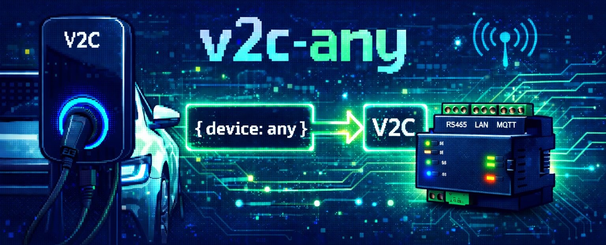

# v2c-any (v2ca)

> **Turn `{ device: any }` into V2C Dynamic Power Control**

**v2c-any** (binary: `v2ca`) is a universal adapter that allows **any device** — physical meters, MQTT topics, simulators, or proxies — to integrate with **V2C wallboxes** for **Dynamic Power Control**.

If it can expose power data, **v2c-any** can make it speak *V2C*.

## Why v2c-any?

V2C wallboxes support Dynamic Power Control via specific meters or MQTT inputs.  
In real installations, however, power data often comes from **heterogeneous sources**:

- Different brands of energy meters  
- Existing MQTT infrastructures  
- Home Assistant sensors  
- Custom hardware or software systems  
- Simulated or virtual meters for testing  

**v2c-any** bridges that gap.

It adapts **any input** into the protocol and format expected by a V2C wallbox — without changing your existing setup.

## The idea

```ts
{ device: any } → V2C
```

Or in practical terms:

```
[Any Meter | MQTT | API | Simulator]
            │
            ▼
         v2c-any
            │
            ▼
       V2C Wallbox
```

## Key features

- 🔌 **Universal adapter** – works with *any* power data source  
- 📡 **MQTT support** – publish once, charge dynamically  
- ⚡ **Dynamic Power Control** – grid, solar, or hybrid scenarios  
- 🧪 **Simulation mode** – emulate supported meters for testing  
- 🔁 **Proxy mode** – forward and transform existing devices  
- 🧩 **Extensible architecture** – add new adapters easily  
- 🟦 **TypeScript-first** – predictable, typed, maintainable  

## Quick Start

### Installation

```bash
# Install globally via npm
npm install -g v2c-any

# Or run directly with npx
npx v2c-any
```

### Configuration

`v2ca` uses [cosmiconfig](https://github.com/cosmiconfig/cosmiconfig) to load configuration. Create a configuration file in one of these formats:

- `.v2carc` (JSON or YAML)
- `.v2carc.json`
- `.v2carc.yaml` or `.v2carc.yml`
- `v2ca.config.js` (CommonJS or ESM)
- `package.json` with a `"v2ca"` key

**Example configuration** (`.v2carc.yaml`):

```yaml
provider: mqtt
properties:
  url: mqtt://localhost:1883
  device: shelly-pro-em
  meters:
    grid:
      mode: pull
      feed:
        type: adapter
        properties:
          interval: 5000
          ip: 192.168.1.100
    solar:
      mode: pull
      feed:
        type: mock
        properties:
          interval: 5000
          value:
            power: 2500
```

### Running

```bash
# Run with auto-detected configuration
v2ca

# Run from source (development)
npm run dev

# Run with Docker
docker run -v $(pwd)/.v2carc.yaml:/app/.v2carc.yaml v2c-any
```

## Operating Modes

`v2c-any` supports two primary operating modes depending on how your V2C wallbox is configured:

### REST Mode (Shelly EM1 Emulator)

Emulates a **Shelly Pro EM** energy meter by exposing a REST API that V2C wallboxes can poll.

**Use this when:**
- Your V2C wallbox is configured to poll a Shelly meter
- You want to act as a drop-in replacement for physical hardware
- You prefer a pull-based (polling) approach

**Configuration example:**

```yaml
provider: rest
properties:
  port: 3000
  device: shelly-pro-em
  meters:
    grid:
      feed:
        type: adapter
        properties:
          ip: 192.168.1.100
    solar:
      feed:
        type: mock
        properties:
          value:          
            id: 1
            voltage: 230.2
            current: 3.785
            act_power: 852.7
            aprt_power: 873.1
            pf: 0.98
            freq: 50
            calibration: factory
```

**How it works:**
1. `v2ca` starts a Fastify HTTP server
2. Exposes endpoints matching Shelly Pro EM API format
3. V2C wallbox polls these endpoints (e.g., `/rpc/EM1.GetStatus?id=0`)
4. Returns real-time power data from your configured sources

### MQTT Mode (Direct Publisher)

Publishes power data directly to MQTT topics that V2C wallboxes subscribe to.

**Use this when:**
- Your V2C wallbox is configured for MQTT integration
- You have an existing MQTT broker
- You want push-based (event-driven) updates
- You need lower latency or more frequent updates

**Configuration example:**

```yaml
provider: mqtt
properties:
  url: mqtt://broker.local:1883
  device: shelly-pro-em
  meters:
    grid:
      mode: pull       # v2ca polls your device
      feed:
        type: adapter
        properties:
          interval: 2000   # Every 2 seconds
          ip: 192.168.1.100
    solar:
      mode: push       # v2ca subscribes to MQTT topic
      feed:
        type: bridge
        properties:
          url: mqtt://solar-meter.local:1883
          topic: solar/power
```

**How it works:**
1. `v2ca` connects to your MQTT broker
2. Publishes to V2C-expected topics (e.g., `trydan_v2c_sun_power`)
3. Supports both **pull** (polling devices) and **push** (subscribing to topics)
4. V2C wallbox subscribes and receives real-time updates

### Mode Comparison

| Feature         | REST Mode                  | MQTT Mode                   |
|-----------------|----------------------------|-----------------------------|
| **Protocol**    | HTTP/REST                  | MQTT                        |
| **Direction**   | Pull (V2C polls v2ca)      | Push (v2ca publishes)       |
| **Latency**     | Higher (polling interval)  | Lower (event-driven)        |
| **Setup**       | Simpler (no broker needed) | Requires MQTT broker        |
| **Use Case**    | Shelly meter replacement   | MQTT-native setups          |
| **Scalability** | Limited by polling         | Better for multiple devices |

## What v2c-any is *not*

- ❌ Not a replacement for your existing meters  
- ❌ Not tied to a single vendor or ecosystem  
- ❌ Not limited to one communication protocol  

It’s an **adapter**, not a lock-in.

## Name origin

`v2c-any` comes from the TypeScript `any` type:

> “I don’t care what you are — I can work with you.”

Exactly the philosophy behind this project.

## License

MIT License - see [LICENSE](LICENSE) for details.
