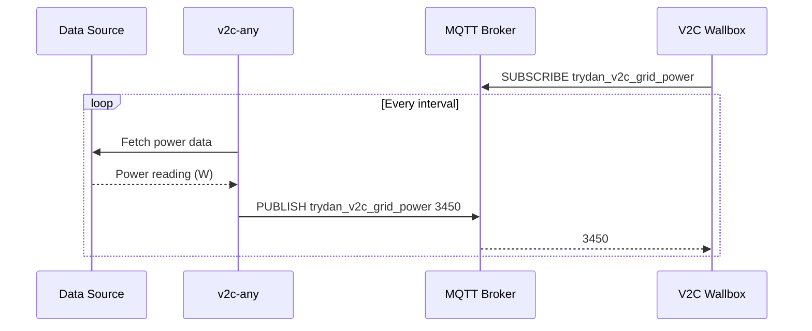
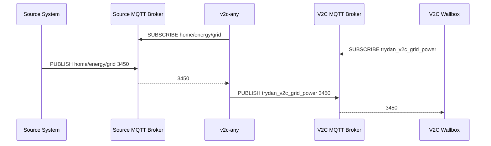

# MQTT Mode

MQTT mode allows **v2c-any** to publish power data directly to MQTT topics that
V2C wallboxes subscribe to. This enables push-based, event-driven updates with
lower latency compared to REST polling.

## When to Use MQTT Mode

**Use MQTT mode when:**

- Your V2C wallbox is configured for MQTT integration
- You have an existing MQTT broker (Mosquitto, HiveMQ, etc.)
- You want push-based, event-driven updates
- You need lower latency or more frequent updates than REST polling allows
- You're integrating with other MQTT-based home automation systems
- You want to bridge multiple MQTT sources

**Don't use MQTT mode when:**

- Your V2C wallbox is only configured for Shelly REST polling (use
  [REST mode](./rest-mode))
- You don't have an MQTT broker and don't want to set one up
- Your data sources don't update frequently enough to benefit from push updates

## MQTT Topics

v2c-any publishes to the following topics that V2C wallboxes subscribe to:

| Topic                   | Description | Format               |
| ----------------------- | ----------- | -------------------- |
| `trydan_v2c_grid_power` | Grid power  | Plain number (watts) |
| `trydan_v2c_sun_power`  | Solar power | Plain number (watts) |

**Example messages:**

```text
trydan_v2c_grid_power: 3450
trydan_v2c_sun_power: 2100
```

## Meter Modes

Each meter (grid/solar) supports two modes:

### Pull Mode

v2c-any actively polls a device at regular intervals and publishes to MQTT.



### Push Mode

v2c-any subscribes to MQTT topics and republishes to V2C topics.



## Configuration

### MQTT Connection Options

| Option     | Type     | Required | Default | Description                                     |
| ---------- | -------- | -------- | ------- | ----------------------------------------------- |
| `url`      | `string` | Yes      | -       | MQTT broker URL (e.g., `mqtt://localhost:1883`) |
| `username` | `string` | No       | -       | Username for MQTT broker authentication         |
| `password` | `string` | No       | -       | Password for MQTT broker authentication         |

## Pull Feed Types

### HTTP Adapter Feed

Polls a device via HTTP at regular intervals and publishes to MQTT.

```yaml
grid:
  mode: pull
  feed:
    type: http-adapter
    properties:
      interval: 2000
      device: shelly-pro-em
      host: 192.168.1.100
```

| Option     | Type                  | Required | Default  | Description                              |
| ---------- | --------------------- | -------- | -------- | ---------------------------------------- |
| `interval` | `number`              | Yes      | -        | Polling interval in milliseconds         |
| `device`   | `string`              | Yes      | -        | Device type (currently: `shelly-pro-em`) |
| `host`     | `string`              | Yes      | -        | IP address or hostname of the device     |
| `protocol` | `'http'` \| `'https'` | No       | `'http'` | Protocol to use                          |
| `port`     | `number`              | No       | `80`     | Port number of the device                |
| `breaker`  | `BreakerOptions`      | No       | -        | Circuit breaker configuration            |
| `retry`    | `RetryOptions`        | No       | -        | Retry strategy configuration             |
| `ema`      | `EmaOptions`          | No       | -        | EMA smoothing configuration              |

### RPC MQTT Adapter Feed

Sends RPC requests over MQTT and processes responses.

```yaml
grid:
  mode: pull
  feed:
    type: rpc-mqtt-adapter
    properties:
      interval: 2000
      device: shelly-pro-em
      url: mqtt://broker:1883
      topic: shellyproem/rpc
      id: shellyproem-abc123
```

| Option     | Type     | Required | Default | Description                              |
| ---------- | -------- | -------- | ------- | ---------------------------------------- |
| `interval` | `number` | Yes      | -       | Request interval in milliseconds         |
| `device`   | `string` | Yes      | -       | Device type (currently: `shelly-pro-em`) |
| `url`      | `string` | Yes      | -       | MQTT broker URL for RPC communication    |
| `username` | `string` | No       | -       | Username for MQTT broker authentication  |
| `password` | `string` | No       | -       | Password for MQTT broker authentication  |
| `topic`    | `string` | Yes      | -       | MQTT topic to publish RPC requests       |
| `id`       | `string` | Yes      | -       | Device identifier used in RPC requests   |

### Mock Feed

Publishes fixed values at regular intervals.

```yaml
solar:
  mode: pull
  feed:
    type: mock
    properties:
      interval: 1000
      value:
        power: 2500
```

| Option     | Type                | Required | Default | Description                         |
| ---------- | ------------------- | -------- | ------- | ----------------------------------- |
| `interval` | `number`            | Yes      | -       | Publishing interval in milliseconds |
| `value`    | `{ power: number }` | No       | -       | Fixed power value in watts          |

### Off Feed

Disables the meter.

```yaml
solar:
  mode: pull
  feed:
    type: off
```

## Push Feed Types

### Bridge Feed

Subscribes to an MQTT topic and republishes to V2C topics.

```yaml
grid:
  mode: push
  feed:
    type: bridge
    properties:
      url: mqtt://source-broker:1883
      device: shelly-pro-em
      topic: home/energy/grid
      keepAlive:
        type: off
```

| Option      | Type              | Required | Default | Description                               |
| ----------- | ----------------- | -------- | ------- | ----------------------------------------- |
| `url`       | `string`          | Yes      | -       | Source MQTT broker URL                    |
| `username`  | `string`          | No       | -       | Username for source broker authentication |
| `password`  | `string`          | No       | -       | Password for source broker authentication |
| `device`    | `string`          | Yes      | -       | Device type for parsing messages          |
| `topic`     | `string`          | Yes      | -       | MQTT topic to subscribe to                |
| `keepAlive` | `KeepAliveConfig` | Yes      | -       | Keep-alive configuration                  |

#### Keep-Alive Configuration

In push mode, v2c-any subscribes to MQTT topics and waits for messages. To
ensure fresh data, you can configure a keep-alive mechanism that periodically
requests data if no messages are received.

The keep-alive timer resets whenever a message is received on the subscribed
topic. If no message arrives within the interval, a request is triggered.

::: code-group

```yaml [Off (default)]
keepAlive:
  type: off
```

```yaml [HTTP-based]
keepAlive:
  type: http-adapter
  properties:
    interval: 30000
    device: shelly-pro-em
    host: 192.168.1.101
```

```yaml [RPC MQTT-based]
keepAlive:
  type: rpc-mqtt-adapter
  properties:
    interval: 30000
    device: shelly-pro-em
    url: mqtt://broker:1883
    topic: shellyproem/rpc
    id: shellyproem-abc123
```

:::

### Off Feed

Disables the meter.

```yaml
solar:
  mode: push
  feed:
    type: off
```

## Examples

### Pull Both Meters

Poll two Shelly Pro EM devices and publish to MQTT:

```yaml
provider: mqtt
properties:
  url: mqtt://localhost:1883
  meters:
    grid:
      mode: pull
      feed:
        type: http-adapter
        properties:
          interval: 2000
          device: shelly-pro-em
          host: 192.168.1.100
    solar:
      mode: pull
      feed:
        type: http-adapter
        properties:
          interval: 2000
          device: shelly-pro-em
          host: 192.168.1.101
```

### Push from Existing MQTT Infrastructure

Bridge existing MQTT topics to V2C topics:

```yaml
provider: mqtt
properties:
  url: mqtt://broker.local:1883
  username: v2c-user
  password: secure-password
  meters:
    grid:
      mode: push
      feed:
        type: bridge
        properties:
          url: mqtt://solar-system.local:1883
          device: shelly-pro-em
          topic: home/energy/grid
          keepAlive:
            type: off
    solar:
      mode: push
      feed:
        type: bridge
        properties:
          url: mqtt://solar-system.local:1883
          device: shelly-pro-em
          topic: home/energy/solar
          keepAlive:
            type: off
```

### Hybrid Pull/Push Configuration

Pull from grid meter, push from existing solar MQTT:

```yaml
provider: mqtt
properties:
  url: mqtt://localhost:1883
  meters:
    grid:
      mode: pull
      feed:
        type: http-adapter
        properties:
          interval: 1000
          device: shelly-pro-em
          host: 192.168.1.100
    solar:
      mode: push
      feed:
        type: bridge
        properties:
          url: mqtt://solar-system.local:1883
          device: shelly-pro-em
          topic: solar/inverter/power
          keepAlive:
            type: http-adapter
            properties:
              interval: 30000
              device: shelly-pro-em
              host: 192.168.1.101
```

### Mock Solar, Real Grid (Testing)

Simulate solar production while using real grid data:

```yaml
provider: mqtt
properties:
  url: mqtt://localhost:1883
  meters:
    grid:
      mode: pull
      feed:
        type: http-adapter
        properties:
          interval: 2000
          device: shelly-pro-em
          host: 192.168.1.100
    solar:
      mode: pull
      feed:
        type: mock
        properties:
          interval: 1000
          value:
            power: 2500
```

### High-Frequency with Resilience

Fast polling with circuit breaker, retry, and EMA smoothing:

```yaml
provider: mqtt
properties:
  url: mqtt://localhost:1883
  meters:
    grid:
      mode: pull
      feed:
        type: http-adapter
        properties:
          interval: 500
          device: shelly-pro-em
          host: 192.168.1.100
          breaker:
            timeout: 300
            errorThresholdPercentage: 20
          retry:
            attempts: 3
            minTimeout: 100
            maxTimeout: 1000
          ema:
            alphaRise: 0.4
            alphaFall: 0.6
            alphaMissing: 0.1
            freshnessThreshold: 2000
    solar:
      mode: pull
      feed:
        type: http-adapter
        properties:
          interval: 500
          device: shelly-pro-em
          host: 192.168.1.101
```

### Secure MQTT with TLS

```yaml
provider: mqtt
properties:
  url: mqtts://secure-broker.local:8883
  username: v2c-client
  password: secure-password
  meters:
    grid:
      mode: pull
      feed:
        type: http-adapter
        properties:
          interval: 2000
          device: shelly-pro-em
          host: 192.168.1.100
          protocol: https
          port: 443
    solar:
      mode: pull
      feed:
        type: off
```

### Complete Mock Setup

Simulate both meters for development:

```yaml
provider: mqtt
properties:
  url: mqtt://localhost:1883
  meters:
    grid:
      mode: pull
      feed:
        type: mock
        properties:
          interval: 1000
          value:
            power: 3500
    solar:
      mode: pull
      feed:
        type: mock
        properties:
          interval: 1000
          value:
            power: 1800
```

## Performance

### Pull Mode

- **Update frequency** - Controlled by `interval` setting
- **Recommended intervals** - 1000-5000ms for most scenarios
- **Network overhead** - Each poll = 1 HTTP request + 1 MQTT publish
- **Resource usage** - ~40-60 MB RAM

### Push Mode

- **Update frequency** - Depends on source MQTT publishing rate
- **Latency** - Very low (~10-50ms from source publish to V2C publish)
- **Network overhead** - 1 MQTT subscription + 1 MQTT publish per update
- **Resource usage** - ~30-50 MB RAM

### Optimization Tips

1. **Use push mode when possible** for lower latency and better efficiency
2. **Don't poll too aggressively** - most scenarios work fine with 2-5 second
   intervals
3. **Enable EMA smoothing** to reduce fluctuations and publish frequency
4. **Use circuit breaker** to prevent overwhelming slow devices
5. **Monitor MQTT broker load** if handling many messages

## Migration

### From REST Mode

1. Set up an MQTT broker if not already running
2. Configure V2C wallbox for MQTT mode instead of Shelly REST polling
3. Update v2c-any configuration to use `provider: 'mqtt'`
4. Choose pull or push mode based on your data sources
5. Test with low intervals first, then optimize

### From Shelly Direct MQTT

1. Keep existing Shelly devices publishing to their topics
2. Configure v2c-any in push mode to bridge Shelly topics to V2C topics
3. Update V2C wallbox to subscribe to v2c-any topics instead of Shelly topics
4. Optionally add resilience features (circuit breaker, retry, EMA)

## Troubleshooting

### V2C wallbox not receiving updates

**Possible causes:**

1. V2C wallbox not subscribed to correct topics
2. MQTT broker not running
3. Network connectivity issues

**Solutions:**

- Verify broker is running: `mosquitto_sub -h localhost -t '#' -v`
- Check v2c-any logs for connection errors
- Ensure V2C wallbox is configured for MQTT mode
- Test publishing manually:
  `mosquitto_pub -h localhost -t trydan_v2c_grid_power -m "1000"`

### Connection refused to MQTT broker

- Verify broker is running: `docker ps` or check system services
- Test connection: `mosquitto_sub -h broker-host -p 1883 -t test`
- Check firewall rules

### Authentication failures

- Verify credentials
- Check broker logs
- Use `mqtts://` for TLS connections

### Updates too slow in pull mode

1. Decrease `interval` value (but not too aggressively)
2. Consider switching to push mode if data source supports it
3. Check network latency to device

### High CPU usage

- Increase `interval` (e.g., from 500ms to 2000ms)
- Add EMA smoothing to reduce update frequency
- Monitor device response times
