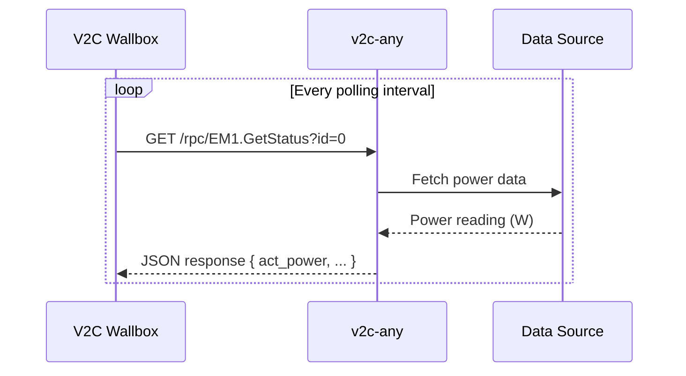

# REST Mode

REST mode allows **v2c-any** to emulate a **Shelly Pro EM** energy meter by
exposing a REST API that V2C wallboxes can poll. This makes v2c-any act as a
drop-in replacement for physical Shelly hardware.

## When to Use REST Mode

Use REST mode when:

- Your V2C wallbox is configured to poll a Shelly Pro EM meter
- You want to replace physical Shelly hardware without reconfiguring your
  wallbox
- You prefer a pull-based (polling) approach
- You don't have or don't want to set up an MQTT broker
- You're testing or simulating meter behavior

> [!WARNING]
>
> Don't use REST mode when:
>
> - Your V2C wallbox is already configured for MQTT (use
>   [MQTT mode](./mqtt-mode) instead)
> - You need very low latency updates (MQTT is faster)
> - You want push-based event-driven updates

## How It Works



1. `v2ca` starts a Fastify HTTP server
2. Exposes endpoints matching the Shelly Pro EM API format
   (`/rpc/EM1.GetStatus`)
3. V2C wallbox polls the endpoint at configured intervals
4. Returns real-time power data from your configured sources

## Configuration

```yaml
provider: rest
properties:
  port: 3000 # HTTP server port
  meters:
    grid:
      feed:
        type: http-adapter
        properties:
          device: shelly-pro-em
          host: 192.168.1.100
    solar:
      feed:
        type: mock
        properties:
          value:
            id: 1
            act_power: 2500
            calibration: factory
```

### HTTP Server Options

| Option | Type     | Required | Default | Description                                 |
| ------ | -------- | -------- | ------- | ------------------------------------------- |
| `port` | `number` | Yes      | -       | Port for the HTTP server (e.g., 3000, 8080) |

### HTTP Adapter Feed Options

| Option     | Type                  | Required | Default  | Description                              |
| ---------- | --------------------- | -------- | -------- | ---------------------------------------- |
| `device`   | `string`              | Yes      | -        | Device type (currently: `shelly-pro-em`) |
| `host`     | `string`              | Yes      | -        | IP address or hostname of the device     |
| `protocol` | `'http'` \| `'https'` | No       | `'http'` | Protocol to use for communication        |
| `port`     | `number`              | No       | `80`     | Port number of the device                |
| `breaker`  | `BreakerOptions`      | No       | -        | Circuit breaker configuration            |
| `retry`    | `RetryOptions`        | No       | -        | Retry strategy configuration             |
| `ema`      | `EmaOptions`          | No       | -        | Exponential moving average smoothing     |

### Mock Feed Options

| Option  | Type        | Required | Description                                               |
| ------- | ----------- | -------- | --------------------------------------------------------- |
| `value` | `EM1Status` | No       | Fixed EM1 status to return. If omitted, returns undefined |

The `EM1Status` object can contain:

| Field         | Type     | Description                          |
| ------------- | -------- | ------------------------------------ |
| `id`          | `number` | EM1 channel ID (`0` or `1`)          |
| `voltage`     | `number` | Voltage in V                         |
| `current`     | `number` | Current in A                         |
| `act_power`   | `number` | Active power in W                    |
| `aprt_power`  | `number` | Apparent power in VA                 |
| `pf`          | `number` | Power factor                         |
| `freq`        | `number` | Frequency in Hz                      |
| `calibration` | `string` | Calibration status (e.g., `factory`) |

## Examples

### Basic Setup - Real Shelly Device

Proxy a real Shelly Pro EM device without modifications:

```yaml
provider: rest
properties:
  port: 3000
  meters:
    grid:
      feed:
        type: http-adapter
        properties:
          device: shelly-pro-em
          host: 192.168.1.100
    solar:
      feed:
        type: http-adapter
        properties:
          device: shelly-pro-em
          host: 192.168.1.101
```

> [!IMPORTANT]
>
> V2C wallbox considers meter ID `0` as grid and `1` as solar. V2C does not
> allow you to define the port number and uses `80` by default, so make sure to
> set the correct port in v2c-any configuration.

### Mock Solar, Real Grid

Use real grid measurements but simulate solar production:

```yaml
provider: rest
properties:
  port: 8080
  meters:
    grid:
      feed:
        type: http-adapter
        properties:
          device: shelly-pro-em
          host: 192.168.1.100
    solar:
      feed:
        type: mock
        properties:
          value:
            id: 1
            voltage: 230.5
            current: 10.87
            act_power: 2500
            aprt_power: 2550
            pf: 0.98
            freq: 50
            calibration: factory
```

### High-Availability Configuration

Add resilience with circuit breaker, retries, and smoothing:

```yaml
provider: rest
properties:
  port: 3000
  meters:
    grid:
      feed:
        type: http-adapter
        properties:
          device: shelly-pro-em
          host: 192.168.1.100
          breaker:
            timeout: 5000
            errorThresholdPercentage: 30
            resetTimeout: 20000
          retry:
            attempts: 5
            minTimeout: 500
            maxTimeout: 30000
          ema:
            alphaRise: 0.3
            alphaFall: 0.5
            alphaMissing: 0.1
            freshnessThreshold: 10000
    solar:
      feed:
        type: off
```

### HTTPS with Custom Port

Connect to a Shelly device behind HTTPS on a non-standard port:

```yaml
provider: rest
properties:
  port: 3000
  meters:
    grid:
      feed:
        type: http-adapter
        properties:
          device: shelly-pro-em
          host: secure-meter.local
          protocol: https
          port: 8443
    solar:
      feed:
        type: off
```

### Complete Mock Setup (Testing)

Simulate both meters for development or testing:

```yaml
provider: rest
properties:
  port: 3000
  meters:
    grid:
      feed:
        type: mock
        properties:
          value:
            id: 0
            voltage: 230.0
            current: 15.5
            act_power: 3565
            aprt_power: 3600
            pf: 0.99
            freq: 50
            calibration: factory
    solar:
      feed:
        type: mock
        properties:
          value:
            id: 1
            act_power: 1800
            calibration: factory
```

## Performance

- **Polling interval** - The V2C wallbox controls how often it polls. Typical
  intervals are 1-10 seconds.
- **Response time** - HTTP adapter feeds add minimal latency (~50-200ms
  depending on network).
- **Concurrent requests** - Fastify server handles multiple simultaneous
  requests efficiently.
- **Resource usage** - Very lightweight (~30-50 MB RAM).

## Migration from Physical Shelly

To migrate from a physical Shelly Pro EM to v2c-any:

1. Note your current V2C wallbox configuration (Shelly IP address).
2. Deploy v2c-any with REST mode on the same IP (or update V2C config).
3. Configure v2c-any to either:
   - Proxy the existing Shelly (`http-adapter` feed)
   - Replace it with another data source
   - Use mock data for testing
4. No changes needed on V2C wallbox if using the same IP address.

## Troubleshooting

### V2C wallbox shows "Meter Offline"

**Possible causes:**

1. Wrong port configured in V2C wallbox
2. Firewall blocking connections
3. v2c-any not running

**Solutions:**

- Verify v2c-any is running: check logs or `curl http://your-host:port/health`
- Check firewall rules
- Ensure V2C wallbox can reach the v2c-any host

### Getting "Unknown ID" errors

The V2C wallbox is requesting a meter ID that isn't configured. Ensure both
`grid` (id=0) and `solar` (id=1) are configured, even if you set one to
`type: 'off'`.

### Power readings are erratic

1. Enable EMA smoothing to reduce fluctuations
2. Increase `freshnessThreshold` to use cached values longer
3. Add retry logic to handle transient network issues

### Circuit breaker keeps opening

- Increase `timeout` value
- Increase `errorThresholdPercentage`
- Increase `resetTimeout` to give the device more recovery time
- Check target device health
