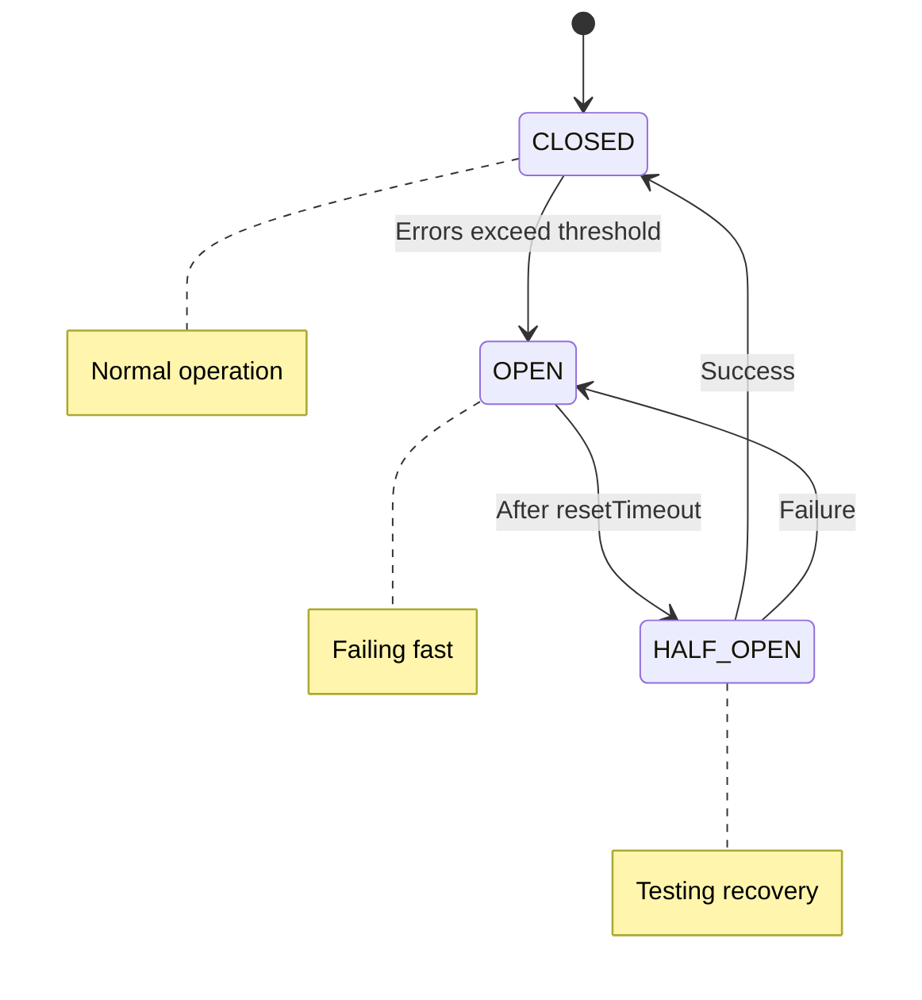

# Resilience

**v2c-any** provides comprehensive resilience features to ensure reliable
operation even when data sources are unstable, slow, or temporarily unavailable.
These features can be applied to any adapter feed in both REST and MQTT modes.

The three main resilience mechanisms are:

| Feature             | Purpose                                            |
| ------------------- | -------------------------------------------------- |
| **Circuit Breaker** | Fail fast when error thresholds are exceeded       |
| **Retry Strategy**  | Retry failed requests with exponential backoff     |
| **EMA Smoothing**   | Smooth readings and handle missing data gracefully |

These features can be used independently or combined for maximum resilience.

## Circuit Breaker

A circuit breaker protects your system from cascading failures when a data
source becomes unreliable or unresponsive. It works like an electrical circuit
breaker - when too many failures occur, it "opens" the circuit and fails fast
instead of waiting for timeouts, giving the failing service time to recover.

### Circuit States



### Configuration

```yaml
breaker:
  timeout: 10000
  errorThresholdPercentage: 50
  resetTimeout: 30000
  rollingCountTimeout: 10000
  rollingCountBuckets: 10
  volumeThreshold: 10
  allowWarmUp: true
```

### Options

| Option                     | Type      | Default | Description                                                         |
| -------------------------- | --------- | ------- | ------------------------------------------------------------------- |
| `timeout`                  | `number`  | `10000` | Maximum time to wait for a response (ms). Exceeding this = failure. |
| `errorThresholdPercentage` | `number`  | `50`    | Error percentage (0-100) required to open the circuit.              |
| `resetTimeout`             | `number`  | `30000` | Time (ms) the circuit stays open before entering half-open state.   |
| `rollingCountTimeout`      | `number`  | `10000` | Time window (ms) for tracking errors.                               |
| `rollingCountBuckets`      | `number`  | `10`    | Number of buckets in the rolling count window.                      |
| `volumeThreshold`          | `number`  | `10`    | Minimum requests before the circuit can open.                       |
| `allowWarmUp`              | `boolean` | `true`  | Allow warm-up period before enforcing thresholds.                   |

### When to Use

Use circuit breaker when:

- Data source is sometimes slow or unresponsive
- You want to prevent cascading failures
- You need to fail fast during outages
- System should give failing services time to recover
- Dealing with remote devices over unreliable networks

> [!WARNING]
>
> Don't use circuit breaker when
>
> - Data source is always reliable and fast
> - Temporary failures are unacceptable (prefer retries instead)
> - You need every request to be attempted

### Examples

::: code-group

```yaml [Conservative]
# Good for stable networks with occasional failures
breaker:
  timeout: 5000
  errorThresholdPercentage: 30
  resetTimeout: 20000
  volumeThreshold: 5
```

```yaml [Aggressive]
# Good for unreliable networks, fail fast
breaker:
  timeout: 2000
  errorThresholdPercentage: 20
  resetTimeout: 10000
  rollingCountTimeout: 5000
  volumeThreshold: 3
```

```yaml [Lenient]
# Good for slow but eventually consistent sources
breaker:
  timeout: 15000
  errorThresholdPercentage: 70
  resetTimeout: 60000
  volumeThreshold: 20
```

:::

## Retry Strategy

Automatic retry with exponential backoff handles transient failures by retrying
failed requests with increasing delays between attempts.

### Retry Behavior


### Configuration

```yaml
retry:
  attempts: 5
  factor: 2
  minTimeout: 1000
  maxTimeout: 60000
  randomize: true
  maxRetryTime: 300000
```

### Options

| Option         | Type      | Default  | Description                              |
| -------------- | --------- | -------- | ---------------------------------------- |
| `attempts`     | `number`  | `3`      | Maximum number of retry attempts.        |
| `factor`       | `number`  | `2`      | Exponential backoff multiplier.          |
| `minTimeout`   | `number`  | `1000`   | Initial delay (ms) before first retry.   |
| `maxTimeout`   | `number`  | `60000`  | Maximum delay (ms) between retries.      |
| `randomize`    | `boolean` | `true`   | Add jitter to prevent thundering herd.   |
| `maxRetryTime` | `number`  | `300000` | Maximum total time (ms) for all retries. |

> [!INFO]
>
> Circuit Breaker Integration
>
> When used with a circuit breaker, retries automatically stop if the circuit
> opens, preventing wasted retry attempts.

### When to Use

Use retry strategy when

- Network connections are occasionally flaky
- Data source has brief, transient failures
- API endpoints occasionally return 5xx errors
- You want to handle temporary outages gracefully

> [!WARNING]
>
> Don't use retry strategy when
>
> - Failures are permanent (e.g., authentication errors)
> - You need immediate failure feedback
> - Retry delays would cause unacceptable latency

### Examples

::: code-group

```yaml [Quick Retries]
# Fast networks with occasional hiccups
# Timing: 0ms → 500ms → 750ms → 1125ms (~2.4s total)
retry:
  attempts: 3
  factor: 1.5
  minTimeout: 500
  maxTimeout: 5000
  randomize: true
```

```yaml [Patient Retries]
# Slow or overloaded services
# Timing: 0ms → 2s → 4s → 8s → 16s → 30s (~60s total)
retry:
  attempts: 5
  factor: 2
  minTimeout: 2000
  maxTimeout: 30000
  randomize: true
  maxRetryTime: 120000
```

```yaml [Aggressive Retries]
# Critical data, many quick attempts
retry:
  attempts: 10
  factor: 1.2
  minTimeout: 100
  maxTimeout: 5000
```

:::

## Exponential Moving Average (EMA)

EMA smooths power readings over time, reducing noise and fluctuations. It's
particularly useful for filtering sensor noise, providing graceful degradation
when data becomes unavailable, and creating asymmetric response curves.

### How It Works

EMA maintains a running average that gives more weight to recent values:

```text
EMA_new = α × new_value + (1 - α) × EMA_old
```

Where `α` (alpha) is the smoothing factor (0 to 1):

- **Higher alpha (e.g., 0.8)** - More responsive to changes (less smoothing)
- **Lower alpha (e.g., 0.2)** - More smoothing (less responsive)

### Asymmetric EMA

v2c-any supports **asymmetric smoothing** with different alphas for rising vs
falling values:

- `alphaRise` - Used when new value > current EMA
- `alphaFall` - Used when new value < current EMA
- `alphaMissing` - Used when data fetch fails (decays toward zero)

> [!TIP]
>
> Example use case
>
> Solar power often rises quickly (cloud clears) but falls slowly (cloud
> approaches). You might want `alphaRise: 0.6` (responsive to increases) and
> `alphaFall: 0.3` (smooth decreases).

### Configuration

```yaml
ema:
  alphaRise: 0.5
  alphaFall: 0.5
  alphaMissing: 0.1
  freshnessThreshold: 10000
```

### Options

| Option               | Type           | Required | Description                                                 |
| -------------------- | -------------- | -------- | ----------------------------------------------------------- |
| `alphaRise`          | `number` (0-1) | Yes      | Smoothing factor when values are increasing.                |
| `alphaFall`          | `number` (0-1) | Yes      | Smoothing factor when values are decreasing.                |
| `alphaMissing`       | `number` (0-1) | Yes      | Smoothing factor when data fetch fails (decay toward zero). |
| `freshnessThreshold` | `number`       | No       | Time (ms) before data is considered stale.                  |

### When to Use

Use EMA when:

- Power readings are noisy or fluctuating
- You want to filter out brief spikes/dips
- Graceful degradation during outages is important
- You need different response rates for increases vs decreases :::

> [!WARNING]
>
> Don't use EMA when:
>
> - You need real-time, unfiltered values
> - Power changes need immediate reflection
> - Your data source already provides smoothed values :::

### Examples

::: code-group

```yaml [Balanced]
# Equal smoothing for rises and falls
ema:
  alphaRise: 0.4
  alphaFall: 0.4
  alphaMissing: 0.1
  freshnessThreshold: 10000
```

```yaml [Fast Rise, Slow Fall]
# Responsive to increases, smooth on decreases (good for solar)
ema:
  alphaRise: 0.7
  alphaFall: 0.2
  alphaMissing: 0.05
  freshnessThreshold: 5000
```

```yaml [Heavy Smoothing]
# Maximum smoothing for very noisy data
ema:
  alphaRise: 0.1
  alphaFall: 0.1
  alphaMissing: 0.01
  freshnessThreshold: 30000
```

```yaml [Minimal Smoothing]
# Light smoothing, highly responsive
ema:
  alphaRise: 0.9
  alphaFall: 0.9
  alphaMissing: 0.3
```

:::

## Combining Features

The three features are applied in layers:


### Full Resilience Stack

```yaml
feed:
  type: http-adapter
  properties:
    device: shelly-pro-em
    host: 192.168.1.100

    # Fail fast if device is down
    breaker:
      timeout: 3000
      errorThresholdPercentage: 25
      resetTimeout: 15000
      volumeThreshold: 5

    # Retry transient failures
    retry:
      attempts: 3
      factor: 2
      minTimeout: 500
      maxTimeout: 5000
      randomize: true

    # Smooth readings and handle gaps
    ema:
      alphaRise: 0.5
      alphaFall: 0.4
      alphaMissing: 0.1
      freshnessThreshold: 10000
```

**Behavior:**

1. **Circuit Breaker** prevents hammering a failing device
2. **Retry** handles brief network issues
3. **EMA** smooths noisy readings and provides graceful degradation
4. If device is down, returns last smoothed value (decaying toward zero)

## Choosing the Right Configuration

### Decision Tree


### Common Scenarios

::: code-group

```yaml [Stable Local Network]
# Reliable local network, occasional Wi-Fi hiccups
retry:
  attempts: 3
  minTimeout: 500
  maxTimeout: 3000
```

```yaml [Unreliable Internet]
# Remote devices over internet, frequent dropouts
breaker:
  timeout: 5000
  errorThresholdPercentage: 30
  resetTimeout: 20000
retry:
  attempts: 4
  minTimeout: 1000
  maxTimeout: 10000
ema:
  alphaRise: 0.4
  alphaFall: 0.4
  alphaMissing: 0.1
  freshnessThreshold: 15000
```

```yaml [Noisy Sensors]
# Reliable connection but readings fluctuate wildly
ema:
  alphaRise: 0.2
  alphaFall: 0.2
  alphaMissing: 0.1
  freshnessThreshold: 5000
```

```yaml [Critical Production]
# Maximum reliability required
breaker:
  timeout: 3000
  errorThresholdPercentage: 20
  resetTimeout: 10000
retry:
  attempts: 5
  factor: 1.5
  minTimeout: 500
  maxTimeout: 5000
ema:
  alphaRise: 0.5
  alphaFall: 0.5
  alphaMissing: 0.1
  freshnessThreshold: 10000
```

:::

## Performance Impact

| Feature         | CPU        | Memory            | Latency                                |
| --------------- | ---------- | ----------------- | -------------------------------------- |
| Circuit Breaker | Negligible | ~1KB per circuit  | <1ms overhead per request              |
| Retry Strategy  | Negligible | Negligible        | Adds delay during failures (by design) |
| EMA Smoothing   | Negligible | 1 value per meter | <1ms overhead per request              |

All resilience features are very lightweight and can be used without performance
concerns.

## Monitoring

v2c-any logs important resilience events:

**Circuit Breaker:**

- `Circuit opened` - Too many failures, circuit opened
- `Circuit half-open` - Testing if service recovered
- `Circuit closed` - Service recovered, normal operation resumed

**Retry:**

- `Attempt to get value failed` - Retry attempt failed (includes
  `attemptNumber`, `retriesLeft`, `retriesConsumed`)

**EMA:**

- `Handling missing value` - Data fetch failed, decaying toward zero
- `Returning last EMA value` - Using cached smooth value
